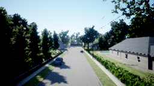
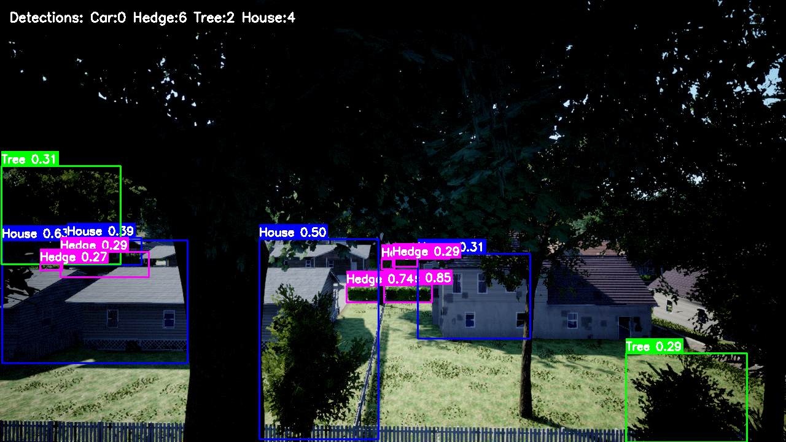
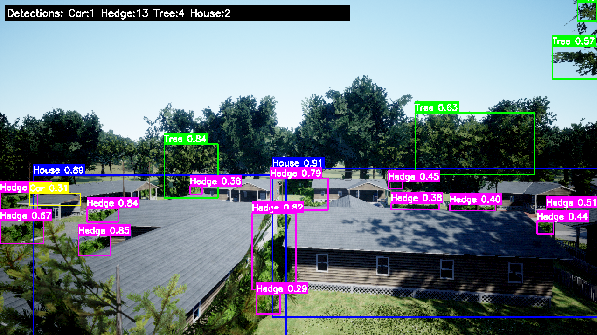
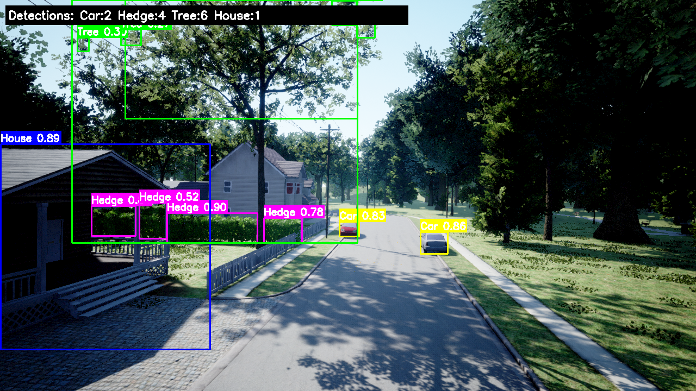
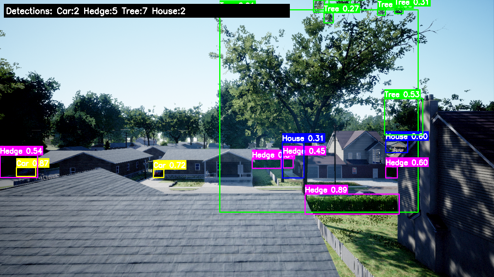

# 🚁 Synthetic Data Generation and Model Training for Aerial Object Detection

Using AirSim simulator to generate synthetic datasets and train YOLO models for autonomous drone vision systems.

## 📋 What this is about

So basically this project is about generating synthetic training data for object detection models using the AirSim simulator instead of collecting real images (which takes forever honestly). I used it to automatically fly a drone around, collect tons of images with perfect labels, and then train a YOLOv11 model to detect stuff.

Main things i did:

- 🎮 **Automatic data collection** - wrote scripts to fly the drone around and capture images automatically cause doing it manually is pain
- 📸 **RGB + Segmentation images** - captures both normal camera view and the segmentation masks at same time 
- 🤖 **YOLO training** - used the generated dataset to train YOLOv11 model from scratch
- 🎨 **Perfect labels** - since its simulation, all the labels are 100% accurate without any manual annotation needed
- 📊 **Bunch of analysis tools** - made scripts to visualize the data, plot flight paths, check model performance etc

---

## 🎬 Some Results

<div align="center">

### 🚁 Aerial view from flights


### 🎯 YOLO Detection Results



### 📈 Inference examples on test data



*synthetic data generation and detection working end to end*

</div>

---

## 🏗️ How it works

```
┌─────────────────────┐
│   AirSim Simulator  │
│   (runs in Unreal)  │
└──────────┬──────────┘
           │
           ▼
┌─────────────────────┐
│  My Python Scripts  │
│  • control drone    │
│  • plan paths       │
│  • save everything  │
└──────────┬──────────┘
           │
           ▼
┌─────────────────────────────────────┐
│        Camera stuff                 │
│  ┌──────────┐  ┌─────────────────┐ │
│  │ RGB Cam  │  │ Segmentation    │ │
│  └────┬─────┘  └────────┬────────┘ │
│       │                 │          │
│       ▼                 ▼          │
│  ┌──────────────────────────────┐ │
│  │   YOLO does detection        │ │
│  │   (YOLOv11 model)            │ │
│  └──────────────────────────────┘ │
└─────────────────────────────────────┘
           │
           ▼
┌─────────────────────┐
│   What we get       │
│  • labeled images   │
│  • flight data      │
│  • training results │
└─────────────────────┘
```

---

## ✨ Main features

### 🎯 Object Detection stuff
- **YOLO integration** - using YOLOv11 which is pretty good for realtime detection
- **Live inference** - can detect objects while drone is flying which is cool
- **Batch mode** - or just process all images later if you want

### 🛸 Flying the drone
- **Autopilot mode** - set waypoints and it flies automatically
- **Manual control too** - can use keyboard to fly around manually when needed
- **Auto landing** - it comes back and lands safely (most of the time lol)

### 📦 Managing all the data
- **Auto capture** - grabs RGB and segmentation images together
- **Multiple sessions** - collected data over multiple flights, have scripts to combine them
- **YOLO format** - everything saved in correct format for training

### 📈 Visualization tools
- **Plot flight paths** - made 3D plots to see where drone flew
- **View detections** - can see bounding boxes on images
- **Debug segmentation** - scripts to check if colors are correct etc

---

## 🚀 How to setup

### What you need

```bash
# need python 3.8 or higher
python --version

# install all the packages
pip install -r requirements_yolo.txt
```

### Getting it running

1. **Install AirSim first**
   - Download from [Microsoft AirSim](https://github.com/microsoft/AirSim)
   - Need to setup Unreal Engine too (kind of annoying but necessary)

2. **Settings file**
   ```bash
   # copy the settings to AirSim folder
   cp settings.json ~/Documents/AirSim/settings.json
   ```

3. **Get YOLO weights** (if you dont have already)
   ```bash
   # downloads the pretrained model
   wget https://github.com/ultralytics/assets/releases/download/v0.0.0/yolo11n.pt
   ```

---

## 💻 How to use

### 1️⃣ Collecting data

**Automatic way (easier)**
```bash
python auto_dataset_collection.py
```

**Manual control (if you wanna fly yourself)**
```bash
python oddDatasetmanualcontrol.py
```

Keyboard controls when flying manually:
- `W/A/S/D` - move forward/left/backward/right
- `Q/E` - go up/down  
- `Arrow Keys` - move camera around
- `Space` - take picture
- `Esc` - land and stop

### 2️⃣ Preparing dataset

```bash
# organize all the collected images
python prepare_dataset.py

# if you have multiple sessions combine them
python combine_sessions.py
```

### 3️⃣ Training the model

```bash
python train_yolo.py
```

You can change stuff in `dataset_config.yaml` file:
```yaml
train: dataset/train
val: dataset/val
nc: 3  # how many classes
names: ['object1', 'object2', 'object3']
```

### 4️⃣ Running inference

**Live mode (while drone flying)**
```bash
python inference_live.py
```

**On saved images**
```bash
python inference_images.py --source path/to/images
```

### 5️⃣ Making plots and stuff

```bash
# plot where the drone flew
python plot_trajectory.py

# see all the stats
python plot_all_data.py

# quick plot
python quick_plot.py
```

---

## 📊 What data gets logged

The scripts save a lot of different info during flights:

| Thing | What it is |
|--------|-------------|
| Timestamp | when stuff happened |
| Position (x,y,z) | where the drone was in 3D space |
| Velocity | how fast it was going |
| Orientation | which direction it was facing (quaternion format) |
| Images Captured | how many RGB and segmentation images saved |

Example from one of my sessions:
```
Data Collection Run: 2026-02-17-19-12-59
Total time: 342.5s
Distance traveled: 1,247m  
Images collected: 856 RGB + 856 Segmentation (paired)
Objects detected: 1,234 total across all frames
Disk space used: 2.3 GB
```

---

## 🗂️ Files and folders

```
AirSim/
├── 📄 Main scripts
│   ├── droneControl.py              # controls the drone flight
│   ├── auto_dataset_collection.py   # auto flies and collects data
│   └── oddDatasetmanualcontrol.py   # manual flying mode
│
├── 🤖 YOLO stuff
│   ├── train_yolo.py               # trains the model
│   ├── inference_live.py           # live detection
│   ├── inference_images.py         # batch detection on images
│   └── test_yolo.py               # testing model
│
├── 🎨 Segmentation scripts
│   ├── debug_segmentation.py      # debug seg issues  
│   ├── diagnose_segmentation.py   # diagnose problems
│   ├── discover_palette.py        # find what colors used
│   └── find_seg_colors.py        # extract color palette
│
├── 📊 Plotting and visualization
│   ├── plot_trajectory.py         # 3D flight path plots
│   ├── plot_all_data.py          # plot everything
│   ├── visualize.py              # general viz
│   └── quick_plot.py             # fast plotting
│
├── 🗃️ Data organization
│   ├── prepare_dataset.py        # organize dataset
│   ├── combine_sessions.py       # merge multiple sessions
│   └── dataset_config.yaml       # config for training
│
└── 📁 Output folders
    ├── dataset/                  # organized training data
    ├── flightLogs/              # all the flight CSV files 
    ├── inference_results/       # detection outputs
    └── runs/                    # training runs and checkpoints
```

---

## 🔧 Configuration

### AirSim Settings (`settings.json`)

```json
{
  "SeeDocsAt": "https://github.com/Microsoft/AirSim/blob/main/docs/settings.md",
  "SettingsVersion": 1.2,
  "SimMode": "Multirotor",
  "Vehicles": {
    "Drone": {
      "VehicleType": "SimpleFlight",
      "Cameras": {
        "rgb": {
          "CaptureSettings": [{"ImageType": 0, "Width": 640, "Height": 480}]
        },
        "segmentation": {
          "CaptureSettings": [{"ImageType": 5, "Width": 640, "Height": 480}]
        }
      }
    }
  }
}
```

---

## 📸 Results and outputs

### Aerial perspective from drone
<div align="center">

<p><em>view from the drone during data collection flights</em></p>
</div>

### YOLO detection results
<div align="center">


<p><em>model detecting objects with bounding boxes - working pretty good</em></p>
</div>

### Inference on test images
<div align="center">


<p><em>running inference on collected test data</em></p>
</div>

---


---


---

## 🔧 Common problems and fixes

**Can't connect to AirSim**
```python
# try this to test connection
python -c "import airsim; client = airsim.MultirotorClient(); client.confirmConnection()"
```
if this fails make sure AirSim is actually running in Unreal lol

**Running out of memory during training**
- reduce the batch size in training script
- make images smaller resolution  
- turn on gradient accumulation if your GPU is struggling

**Segmentation colors not working**
```bash
python discover_palette.py  # this will find all available colors
```
sometimes AirSim uses different colors than expected, run this to check

---

## 📚 What libraries i used

Main packages needed:
- `airsim` - to talk to the simulator
- `ultralytics` - for YOLO stuff
- `opencv-python` - image processing
- `numpy` - all the array operations
- `matplotlib` - making plots
- `pandas` - handling data

full list is in [requirements_yolo.txt](requirements_yolo.txt)

---

## 🤝 If you wanna contribute

feel free to improve stuff! some ideas:

- [ ] add multi-drone support (would be cool to have multiple drones flying)
- [ ] obstacle avoidance (right now it just crashes into things sometimes)
- [ ] more object classes for detection
- [ ] integrate depth camera data  
- [ ] make a GUI for monitoring everything in real-time

just open a PR if you add something useful

---

## 📄 License

This is for educational/research use.

---

## 🙏 Credits

- **Microsoft AirSim** - the simulator i used
- **Ultralytics** - for the YOLO implementation  
- **OpenCV** - image processing stuff

---

## 📧 Questions?

if something doesn't work or you have questions just open an issue

---

<div align="center">

**Synthetic Data Generation for Aerial Object Detection**

*Built with AirSim • YOLOv11 • Python*

⭐ star this if it helped you!

</div>
